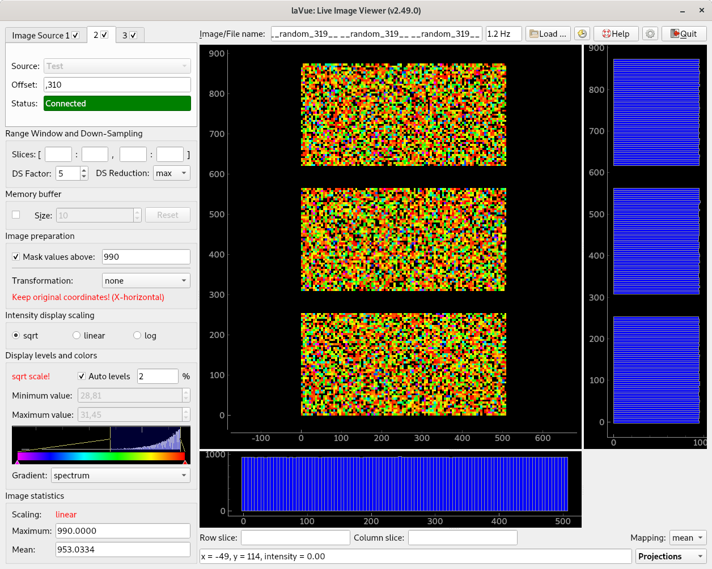

  .. default-domain:: py

Graphical Interface
===================

*    **Image Source(s)** is(are) in the corner of the main window top left side where a lavue user chooses  a detector image source.
..

*    Below it  the **Range Window and Down-Sampling**  group allows for selecting a displayed image part and down-sampling it  with a given reduction function
*    In the **Filters** group users adds his/her plugins for evaluating images
*    the **Memory buffer** group allows to access previously displayed images
*    In the **Image preparation** group a background and mask image can be selected as well simple image transformation, i.e. flip, transpose.
*    In the **Intensity display scaling** frame the user selects what intensity scaling should be selected to fit the proper colors on the 2D-image display.
*    The **Display levels and colors** widget is used so set minimum and maximum displayed intensity and choose the display color gradient.
*    The **Image statistics** part shows the basic statistic information about the 2D-image.

..

*    On the top right side of the main window the user finds an **Image/File name** label as well as a button for **Load** images from a file-system, **Reload** images from a file -system, this Help, the Configuration and Quit buttons.
*    Below them the detector **2D image** is displayed with associated **1D-plots**.

..

*    At the bottom of the right side the user selects **Specialized Image Tools** which provide a simple analysis of the detector image.

Contents
========

.. toctree::
   :maxdepth: 2

   imagesources/index
   rangewindow
   fileters
   memorybuffer
   imagepreparation
   scaling
   statistics
   plot
   tools/index
   images
   configuration/index
