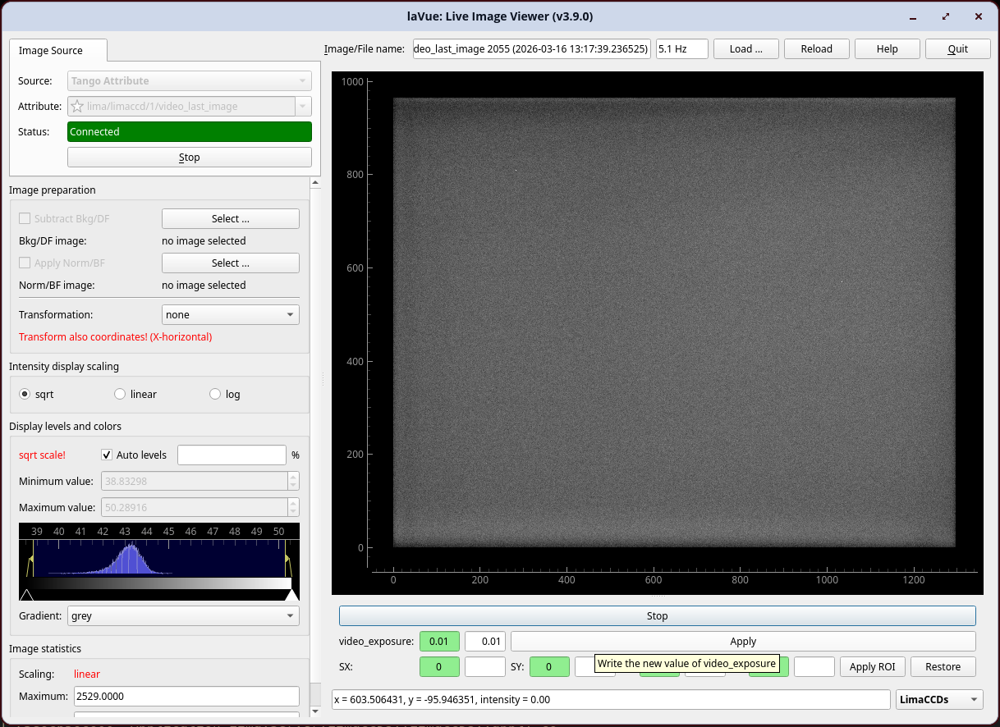

.. _limaccds:

LimaCCDs Tool
=============

**LimaCCDs Tool** allows to control the video mode of a LimaCCDs-based detector: start/stop live acquisition and read/write video parameters such as exposure, gain and the video ROI. This requires that the lima plugin of the camera implements the ``ctVideo`` interface.

*    **Start/Stop:** toggles the ``video_live`` attribute on the LimaCCDs TANGO device to start or stop continuous video acquisition
*    **video_exposure:** reads the current exposure time from the green widget and writes a new value via the white edit widget and the **Apply** button
*    **video_gain:** reads the current gain from the green widget and writes a new value via the white edit widget and the **Apply** button
*    **ROI (SX, SY, LX, LY):** reads and writes the ``video_roi`` spectrum attribute (start-x, start-y, length-x, length-y); the **Apply ROI** button writes the four values to the device and the **Restore** button resets the ROI to ``[0, 0, 0, 0]``

The scalar attributes displayed (``video_exposure``, ``video_gain``) are probed at activation time; only attributes that are both present and writable on the connected device are shown.

The device name is auto-detected from the active TANGO Attribute image source when the tool is activated. It can also be set explicitly via the tool configuration.

The **configuration** of the tool can be set with a JSON dictionary passed in the ``--tool-configuration`` option in command line or a ``toolconfig`` variable of ``LavueController.LavueState`` with the following keys:

``limaccds_device`` (string) - the TANGO device name of the LimaCCDs server (e.g. ``"id00/limaccds/detector"``)

e.g.

.. code-block:: console

   lavue -u limaccds -s tangoattr --tool-configuration \{\"limaccds_device\":\"id00/limaccds/detector\"\} --start

.. |br| raw:: html

      
